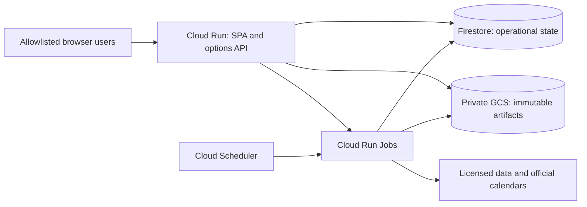

# Cheap hosted POC

## Recommended design

Use the existing image/SPA, adding a **restricted options profile**. Serve the
app from a request-billed Cloud Run service that scales to zero. Store small
mutable records in Firestore Standard/Native mode, and immutable licensed data,
backtest reports and consistent backup artifacts in a private regional GCS
bucket. Run scans/backtests as bounded Cloud Run Jobs; Cloud Scheduler starts
scheduled executions. No Cloud SQL is provisioned.

This diagram documents a proposed deployment; no resources exist from this PR.

## Why not SQLite on a bucket?

Cloud Storage FUSE does not supply file locking or full POSIX semantics; concurrent
writes can replace each other. It is unsuitable as the filesystem for an active
SQLite database. Cloud Run's ordinary writable container storage is ephemeral,
and a Docker `VOLUME` does not provision a durable cloud disk. Setting max instances
to one is a cost control, not a distributed lock or protection from revision overlap.
See [Google's mount limitations](https://docs.cloud.google.com/run/docs/configuring/services/cloud-storage-volume-mounts)
and [runtime contract](https://docs.cloud.google.com/run/docs/container-contract).

| Alternative | Decision |
|---|---|
| Cloud Run + Firestore + GCS | Recommended: little idle infrastructure cost, durable transactions, explicit small adapter scope |
| Immutable SQLite snapshot in GCS, downloaded read-only | Valid later for a read-only research viewer; does not solve mutable paper positions or job state |
| Download/write/upload whole SQLite on each request | Reject: lost updates, crash windows and expensive full-object writes; generation checks alone are not multi-record workflow transactions |
| SQLite on a tiny Compute Engine VM + persistent disk + backups | Plausible if keeping the entire existing app unchanged matters more than serverless; price disk, IPv4, backups and operations before choosing; do not call it unconditionally free |
| Filestore, always-on database VM, Cloud SQL | Outside this POC's low-idle-cost design |

## Concrete initial envelope

- Region `us-central1` proposed, with colocated service, Jobs, Firestore and
  bucket. HTTPS `run.app` URL first, no custom domain/load balancer/NAT/VPC
  connector/Redis. Region and project remain Q11 decisions.
- Service: 1 vCPU, 1 GiB memory initially, request billing, min instances 0,
  max instances 1, concurrency 8, 60-second request timeout. Browser requests
  only read bounded views or durably request jobs; they do not run backtests.
  Verify memory against the actual image and datasets before changing limits.
- Jobs: one task, parallelism 1, explicit 30-minute task timeout, one platform
  retry, application-level idempotency and lease renewal. Default scan workload
  50 tickers; user backfills enforce date/contract/request/byte and runtime caps.
  Multiple executions can overlap despite these settings: transactional claims
  and a global active-research-job budget control publication and resource use.
- Two schedules: daily research after the provider's documented EOD availability
  and hourly event/deadline checks during weekday exchange hours. Check
  exchange closures in the worker, not a naïve weekday cron. EOD retrieval lag
  may mean the next morning; do not pretend the result existed yesterday.
  Job dispatch can combine maintenance/backup with the daily execution to avoid
  an unnecessary always-on scheduler loop. No browser session keeps work alive.
- Results display last successful run, input cutoff/delay, next expected update,
  elapsed job age and failures. A missed hourly check is visible within the next
  successful check; a missed session's research becomes stale, suppressing new
  actionable entries. Deadline changes do not wait for the daily scan.
- Deploy the same tested `linux/amd64` image by immutable digest. Explicitly
  configure Cloud Run's container port 8787 and `serve --host 0.0.0.0 --port 8787`
  (or implement declared `PORT` mapping once); Docker EXPOSE/HEALTHCHECK alone
  are not Cloud Run configuration. Configure actual startup/readiness probes.
  GCP SDKs live in a new optional cloud extra; default offline install stays keyless.

## Persistence, jobs, and recovery

Every acknowledged configuration/position/job write commits to Firestore before
success. Partition records by stable IDs; prohibit unbounded collection scans and
large embedded quote arrays. Store artifact hashes, object
generation and schema version, not expiring signed URLs, in metadata.

Job creation commits a durable request before dispatch. If the Cloud Run Jobs
API call fails or the web process dies between commit and dispatch, a scheduler
reconciler discovers pending requests. Duplicate launches claim the same job;
only the current fencing token may checkpoint, publish or complete it. A crash
leaves a reclaimable lease. Export durable progress; use bounded polling in
the cloud profile instead of indefinite SSE requests. Cancellation is persisted
and checked between bounded chunks. No work depends on post-response CPU time.

Atomic domain operations include reserve/release paper budget, compare-and-swap
model promotion, publish revision and job claims. Transaction callbacks do no
provider or GCS I/O because Firestore may retry them. Repository conformance
tests cover failed transactions, contention, stale leases, pagination and schema
upgrades, against SQLite and the Firestore emulator; a bounded real-project smoke
verifies emulator assumptions.

Private GCS artifacts use unique content-addressed IDs and conditional creation.
Verify upload before publishing a pointer; readers verify checksum/schema before
use. No raw quote redistribution unless licensed. Authorized report downloads
are streamed or use short-lived signed URLs. Retention must preserve every
manifest needed to reproduce an active model; purge only unreferenced objects
whose data rights permit retention/deletion. Raw bulk OPRA archives are not the
small-cost plan: bound imports to the contracted universe and date range.

Nightly logical operational backup: set a maintenance fence, pause/drain writers
and dispatch, snapshot all required owned repositories, write a verified manifest,
then resume. Export positions, models and jobs. Retain 30 rolling daily backups
provisionally; encryption/IAM and licensed artifact retention apply. A failure to
resume raises an owner-visible incident.

Restore to a fresh isolated namespace, check record counts/hashes/references,
schema compatibility and invariant totals, and exercise login and paper reads.
Proposed RPO 24h/RTO 4h is a POC target, not high availability. Local SQLite
exports still use the backup API with committed WAL data, not live-file copying.

## Access and configuration

Single shared research workspace, two allowlisted Google identities initially.
Validate Google ID tokens server-side for signature, issuer, audience, expiry and
verified email; map stable subject IDs to viewer/owner roles. Secure HttpOnly
SameSite cookies, bounded sessions, CSRF protection and logout; local shared-token
auth must not accidentally bypass the hosted identity boundary. Promotion,
configuration and paper changes have explicit role checks.

The Cloud Run web service may allow transport-level unauthenticated access so
the login page is reachable, but all research routes enforce application auth.
Internal job launch/scheduler calls use service-account IAM with verified audience
and least privileges; reject forged headers. Firestore client access from browsers
is denied; access uses the server's service identity.

Use runtime Secret Manager references and service identities, no downloaded JSON
service-account keys in the image. Declare all knobs in `settings.py` with doctor
checks, scopes and redaction; never enable arbitrary browser edits of cloud
project/bucket, credential, artifact path or deployment configuration. Health
publishes minimal status; logs redact tokens and credential URLs.

## Cost worksheet — checked 18 September 2026

These are estimates for an explicitly bounded workload, not vendor promises.

| Bucket | Workload / basis | Planning allowance |
|---|---|---|
| Cloud Run web | 2 users, 10,000 requests/month, 1 second average billed instance time; 1 CPU/1 GiB | ~10,000 CPU-s and GiB-s; approximately $0 within otherwise-unused eligible free tier |
| Cloud Run Jobs | 22 daily 5-minute scans plus 176 hourly 1-minute checks | ~17,160 CPU-s/GiB-s before retries/startup; about $0.34 at listed CPU+memory rates even before eligible free quota |
| Firestore | <10k reads/day, <2k writes/day, <0.1 GiB; no tick data | Expected within standard free quota if available; backups/restore/TTL or extra databases may cost extra |
| GCS, builds, image storage, secrets, logs, Scheduler, egress | <=1 GiB curated artifacts initially; bounded backups/images/logs, two schedules | Reserve $0–5/month overall infrastructure; measure actual SKUs, regions, retention and account-wide usage |
| Market/event data | Must include historical bid/ask and permitted display | Undecided; may dominate every other line; do not budget the guide's $29 as a verified all-in solution |

Cloud Run's published request tier includes 180k CPU-s, 360k GiB-s and 2m
requests monthly; Jobs have different free allowances and billing behavior.
Account-wide free usage may already be consumed. See
[Cloud Run pricing](https://cloud.google.com/run/pricing).
Firestore lists 1 GiB, 50k reads and 20k writes daily for one qualifying database;
backup/restore-related services are not all free. See
[Firestore pricing](https://firebase.google.com/docs/firestore/pricing).
Scheduler lists three free jobs per billing account and then $0.10/job/month;
see [Scheduler pricing](https://cloud.google.com/scheduler/pricing).
Ancillary estimates must include [GCS storage/operations and retained versions](https://cloud.google.com/storage/pricing),
[Secret Manager versions/access](https://cloud.google.com/secret-manager/pricing),
and [image registry storage/transfer](https://cloud.google.com/artifact-registry/pricing).
Use Standard regional storage for the tiny active dataset; retention and soft
deletion consume storage even after a file disappears from the current view.

Install 50/80/100% budget alerts, request/rate quotas, bounded job launch and
provider-fetch counts and a manual pause switch. Billing alerts and max instances
are **not hard spend caps**. Estimate each backfill before starting; stop
nonessential research when application quotas exhaust and show the reason.
Preserve status/exit information. Never claim the entire product is free because
the web process can scale to zero.

## Terraform layout and practices

All hosted resources are declared in a versioned Terraform root module under
`deploy/terraform/` (proposed) and applied only through `sobres deploy cloud-run`.
Nothing in the hosted profile is created by hand in the console; anything found
created by hand is imported with `terraform import` or destroyed before acceptance.

- **Pinned versions.** `required_version` for Terraform and `~>` constraints for
  the `google` provider, with the dependency lock file committed. `sobres doctor`
  reports a binary outside the pinned range with the install command as its fix.
- **Remote state with locking.** A GCS backend bucket with object versioning,
  created once by a tiny bootstrap module; the GCS backend locks state natively.
  One state per environment (`smoke`, `poc`) through the backend prefix, never a
  shared local state. The CLI refuses to run against local state.
- **Plan, then apply that plan.** `plan -out` to a saved file, review, then
  `apply <planfile>`. An apply without a saved plan, or with a plan older than
  the current state serial, is rejected. `plan -detailed-exitcode` is the drift
  check run before every apply and during the first-week review.
- **No secrets in Terraform.** Secret Manager secrets (the containers), their
  IAM bindings and the Cloud Run references are Terraform resources; secret
  versions (the values) are added by the human with `gcloud secrets versions add`
  and never appear in `.tfvars`, variables, outputs or state. Variables that
  could carry credentials are `sensitive = true` and read from the environment.
- **Least privilege.** Separate service accounts for the web service, the jobs
  and the scheduler invoker, each with only the roles the module lists; no
  downloaded service-account keys anywhere. The deploying human uses their own
  `gcloud` identity with a scoped deployer role.
- **Protected data.** The artifact bucket, the backup bucket and the Firestore
  database carry `lifecycle { prevent_destroy = true }`. `deploy cloud-run destroy`
  removes compute, schedules, IAM and secret containers by default and removes
  data resources only with `--include-data`, a second typed confirmation and a
  verified export on record.
- **Labels and naming.** Every resource is labelled `app=sobres`,
  `profile=options-poc` and `env=<name>`; names derive from one prefix variable so
  a second environment is a variable change, not a copied module.
- **Immutable images.** The service and jobs reference an image digest, never a
  floating tag; a rollback is an apply with the previous digest.
- **CI never applies.** CI runs `terraform fmt -check` and `terraform validate`
  on the module with no credentials. Plan, apply and destroy happen only from a
  human's terminal through the CLI.
- **Outputs feed the CLI.** The service URL, job names, bucket names and secret
  names are Terraform outputs the CLI reads for `doctor`, the runbook and the
  acceptance record; nothing is retyped by hand.

## Human-gated prerequisites

These are owner actions. No implementation task that depends on one may be marked
done before it, and none of them is performed by CI or by an agent.

| ID | Owner action | Unblocks |
|---|---|---|
| H1 | Obtain API keys, or complete API documentation with sample payloads, for the two vendors chosen under Q12 (Massive and ThetaData). Confirm each sample carries historical bid/ask with sizes and timestamps, contract identity fields, corporate-action handling and earnings confirmation timestamps, so the port can be designed against real differences and the data is what options research needs. Record the capability matrix under Q12. | A2 and the provider ports in `design.md` §6.1 |
| H2 | Create or select the GCP project and billing account. Install and authenticate the `gcloud` CLI and Terraform at the pinned versions, run the bootstrap module for the state bucket, then create the Secret Manager secrets and add their values with `gcloud secrets create` and `gcloud secrets versions add --data-file=-`, typed or piped locally. Values are never committed and never passed to the Sobres CLI. | D4 |
| H3 | Approve the hosting, data and one-time history budgets (Q5) and the budget-alert recipients (Q11). | B6 and D4 |

## Deployment implementation and acceptance runbook

The implementation PR adds the Terraform modules, the `deploy cloud-run` commands
and an operator runbook with these steps and saved outputs:

1. Complete H1–H3. Run `sobres doctor` for the cloud profile: it must confirm
   `gcloud` authentication and project, the Terraform version, the state bucket,
   the named secrets and the licensed-data settings, printing no secret values.
2. Run `sobres deploy cloud-run plan` for the `poc` environment and review the
   saved plan: bucket, Firestore, service accounts, secret containers, service,
   jobs, two schedules and budget alerts. Then `sobres deploy cloud-run apply`
   of that plan.
3. Deploy the image digest through the module variables; run a fixture-backed
   smoke in the isolated `smoke` environment and a bounded real-provider
   quote/event probe.
4. Open HTTPS URL on a fresh browser: unauthorized access fails; allowed login
   shows evidence, recommendation state and paper-position confirmation flows.
5. Kill an active worker, force scale-to-zero/revision replacement and retry job
   dispatch; verify state survival, fenced publication and no duplicate publication.
6. Perform backup/restore to a fresh namespace; demonstrate rollback to the prior
   digest plus a compatible model version by re-applying the previous digest.
7. Run `sobres deploy cloud-run destroy` for the `smoke` environment: confirm the
   printed resource list and the typed project confirmation, that data resources
   survive without `--include-data`, and that a following `plan` reports nothing
   left to destroy. The same command retires the `poc` environment later, with
   `--include-data` only after a verified export.
8. Record measured first-week usage and extrapolated monthly costs; revise quotas
   or pause expansion if they exceed approved budgets. Save the deployment URL,
   Terraform outputs and evidence before calling hosting complete.
