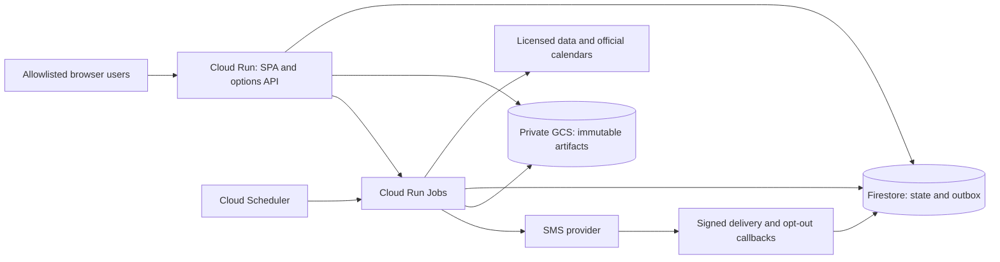

# Cheap hosted POC

## Recommended design

Use the existing image/SPA, adding a **restricted options profile**. Serve the
app from a request-billed Cloud Run service that scales to zero. Store small
mutable records in Firestore Standard/Native mode, and immutable licensed data,
backtest reports and consistent backup artifacts in a private regional GCS
bucket. Run scans/backtests/notification dispatch as bounded Cloud Run Jobs;
Cloud Scheduler starts scheduled executions. No Cloud SQL is provisioned.

This diagram documents a proposed deployment; no resources exist from this PR.

## Why not SQLite on a bucket?

Cloud Storage FUSE does not supply file locking or full POSIX semantics; concurrent
writes can replace each other. It is unsuitable as the filesystem for an active
SQLite database. Cloud Run's ordinary writable container storage is ephemeral,
and a Docker `VOLUME` does not provision a durable cloud disk. Setting max instances
to one is a cost control, not a distributed lock or protection from revision overlap.
See [Google's mount limitations](https://docs.cloud.google.com/run/docs/configuring/services/cloud-storage-volume-mounts)
and [runtime contract](https://docs.cloud.google.com/run/docs/container-contract).

| Alternative | Decision |
|---|---|
| Cloud Run + Firestore + GCS | Recommended: little idle infrastructure cost, durable transactions, explicit small adapter scope |
| Immutable SQLite snapshot in GCS, downloaded read-only | Valid later for a read-only research viewer; does not solve mutable subscriptions, paper positions or alert deduplication |
| Download/write/upload whole SQLite on each request | Reject: lost updates, crash windows and expensive full-object writes; generation checks alone are not multi-record workflow transactions |
| SQLite on a tiny Compute Engine VM + persistent disk + backups | Plausible if keeping the entire existing app unchanged matters more than serverless; price disk, IPv4, backups and operations before choosing; do not call it unconditionally free |
| Filestore, always-on database VM, Cloud SQL | Outside this POC's low-idle-cost design |

## Concrete initial envelope

- Region `us-central1` proposed, with colocated service, Jobs, Firestore and
  bucket. HTTPS `run.app` URL first, no custom domain/load balancer/NAT/VPC
  connector/Redis. Region and project remain Q12 decisions.
- Service: 1 vCPU, 1 GiB memory initially, request billing, min instances 0,
  max instances 1, concurrency 8, 60-second request timeout. Browser requests
  only read bounded views or durably request jobs; they do not run backtests.
  Verify memory against the actual image and datasets before changing limits.
- Jobs: one task, parallelism 1, explicit 30-minute task timeout, one platform
  retry, application-level idempotency and lease renewal. Default scan workload
  50 tickers; user backfills enforce date/contract/request/byte and runtime caps.
  Multiple executions can overlap despite these settings: transactional claims
  and a global active-research-job budget control publication and resource use.
- Two schedules: daily research after the provider's documented EOD availability
  and hourly event/deadline/outbox checks during weekday exchange hours. Check
  exchange closures in the worker, not a naïve weekday cron. EOD retrieval lag
  may mean the next morning; do not pretend the result existed yesterday.
  Job dispatch can combine maintenance/backup with the daily execution to avoid
  an unnecessary always-on scheduler loop. No browser session keeps work alive.
- Results display last successful run, input cutoff/delay, next expected update,
  elapsed job age and failures. A missed hourly check is visible within the next
  successful check; a missed session's research becomes stale, suppressing new
  actionable entries. Deadline changes do not wait for the daily digest.
- Deploy the same tested `linux/amd64` image by immutable digest. Explicitly
  configure Cloud Run's container port 8787 and `serve --host 0.0.0.0 --port 8787`
  (or implement declared `PORT` mapping once); Docker EXPOSE/HEALTHCHECK alone
  are not Cloud Run configuration. Configure actual startup/readiness probes.
  GCP SDKs live in a new optional cloud extra; default offline install stays keyless.

## Persistence, jobs, and recovery

Every acknowledged configuration/position/subscription/job write commits to
Firestore before success. Partition records by stable IDs; prohibit unbounded
collection scans and large embedded quote arrays. Store artifact hashes, object
generation and schema version, not expiring signed URLs, in metadata.

Job creation commits a durable request before dispatch. If the Cloud Run Jobs
API call fails or the web process dies between commit and dispatch, a scheduler
reconciler discovers pending requests. Duplicate launches claim the same job;
only the current fencing token may checkpoint, publish or complete it. A crash
leaves a reclaimable lease. Export durable progress; use bounded polling in
the cloud profile instead of indefinite SSE requests. Cancellation is persisted
and checked between bounded chunks. No work depends on post-response CPU time.

Atomic domain operations include reserve/release paper budget, compare-and-swap
model promotion, publish revision plus outbox, subscription consent changes and
job/outbox claims. Transaction callbacks do no provider, GCS or SMS I/O because
Firestore may retry them. Repository conformance tests cover failed transactions,
contention, stale leases, pagination and schema upgrades, against SQLite and the
Firestore emulator; a bounded real-project smoke verifies emulator assumptions.

Private GCS artifacts use unique content-addressed IDs and conditional creation.
Verify upload before publishing a pointer; readers verify checksum/schema before
use. No raw quote redistribution unless licensed. Authorized report downloads
are streamed or use short-lived signed URLs. Retention must preserve every
manifest needed to reproduce an active model; purge only unreferenced objects
whose data rights permit retention/deletion. Raw bulk OPRA archives are not the
small-cost plan: bound imports to the contracted universe and date range.

Nightly logical operational backup: set a maintenance fence, pause/drain writers
and dispatch, snapshot all required owned repositories, write a verified manifest,
then resume. Provider callbacks received during the fence are not acknowledged
as persisted unless safely stored; retryable responses plus reconciliation recover
them. Export active opt-out/suppression state as well as positions, models and
jobs. Retain 30 rolling daily backups provisionally; encryption/IAM and licensed
artifact retention apply. A failure to resume raises an owner-visible incident.

Restore to a fresh isolated namespace, check record counts/hashes/references,
schema compatibility and invariant totals, and exercise login and paper reads.
**SMS stays disabled after restore** until current provider opt-outs and submitted/
unknown sends are reconciled; restoring old consent is not permission to resend.
Proposed RPO 24h/RTO 4h is a POC target, not high availability. Local SQLite
exports still use the backup API with committed WAL data, not live-file copying.

## Access and configuration

Single shared research workspace, two allowlisted Google identities initially.
Validate Google ID tokens server-side for signature, issuer, audience, expiry and
verified email; map stable subject IDs to viewer/owner roles. Secure HttpOnly
SameSite cookies, bounded sessions, CSRF protection and logout; local shared-token
auth must not accidentally bypass the hosted identity boundary. Promotion,
configuration, subscription and paper changes have explicit role checks.

The Cloud Run web service may allow transport-level unauthenticated access so
the login page and signed SMS callbacks are reachable, but all research routes
enforce application auth. Internal job launch/scheduler calls use service-account
IAM with verified audience and least privileges; reject forged headers. A narrowly
scoped webhook route accepts only correctly signed provider callbacks with
deduplicated event IDs. Firestore client access from browsers is denied; access
uses the server's service identity.

Use runtime Secret Manager references and service identities, no downloaded JSON
service-account keys in the image. Declare all knobs in `settings.py` with doctor
checks, scopes and redaction; never enable arbitrary browser edits of cloud
project/bucket, credential, artifact path or deployment configuration. Health
publishes minimal status; logs redact phones, tokens and credential URLs.

## Cost worksheet — checked 18 September 2026

These are estimates for an explicitly bounded workload, not vendor promises.

| Bucket | Workload / basis | Planning allowance |
|---|---|---|
| Cloud Run web | 2 users, 10,000 requests/month, 1 second average billed instance time; 1 CPU/1 GiB | ~10,000 CPU-s and GiB-s; approximately $0 within otherwise-unused eligible free tier |
| Cloud Run Jobs | 22 daily 5-minute scans plus 176 hourly 1-minute checks | ~17,160 CPU-s/GiB-s before retries/startup; about $0.34 at listed CPU+memory rates even before eligible free quota |
| Firestore | <10k reads/day, <2k writes/day, <0.1 GiB; no tick data | Expected within standard free quota if available; backups/restore/TTL or extra databases may cost extra |
| GCS, builds, image storage, secrets, logs, Scheduler, egress | <=1 GiB curated artifacts initially; bounded backups/images/logs, two schedules | Reserve $0–5/month overall infrastructure; measure actual SKUs, regions, retention and account-wide usage |
| SMS | 200 U.S. outbound single segments at $0.0083 | $1.66 base transport **plus** carrier fees, number rental, registration/campaign fees, inbound/failed segments and tax; obtain actual sender quote |
| Market/event data | Must include historical bid/ask and permitted display | Undecided; may dominate every other line; do not budget the guide's $29 as a verified all-in solution |

Cloud Run's published request tier includes 180k CPU-s, 360k GiB-s and 2m
requests monthly; Jobs have different free allowances and billing behavior.
Account-wide free usage may already be consumed. See
[Cloud Run pricing](https://cloud.google.com/run/pricing).
Firestore lists 1 GiB, 50k reads and 20k writes daily for one qualifying database;
backup/restore-related services are not all free. See
[Firestore pricing](https://firebase.google.com/docs/firestore/pricing).
Scheduler lists three free jobs per billing account and then $0.10/job/month;
see [Scheduler pricing](https://cloud.google.com/scheduler/pricing).
SMS is billed by segment; [Twilio pricing](https://www.twilio.com/en-us/sms/pricing/us)
lists additional carrier/onboarding costs. Sender type/business registration must
be quoted for this use case, not borrowed from a sole-proprietor example.
Ancillary estimates must include [GCS storage/operations and retained versions](https://cloud.google.com/storage/pricing),
[Secret Manager versions/access](https://cloud.google.com/secret-manager/pricing),
and [image registry storage/transfer](https://cloud.google.com/artifact-registry/pricing).
Use Standard regional storage for the tiny active dataset; retention and soft
deletion consume storage even after a file disappears from the current view.

Install 50/80/100% budget alerts, request/rate quotas, bounded job launch and
provider-fetch counts, a transactional monthly SMS segment cap and a manual
pause switch. Billing alerts and max instances are **not hard spend caps**.
Estimate each backfill before starting; stop nonessential research/notifications
when application quotas exhaust and show the reason. Preserve opt-out processing
and status/exit information. Never claim the entire product is free because the
web process can scale to zero.

## Deployment implementation and acceptance runbook

The implementation PR adds reproducible infrastructure configuration and an
operator runbook with these steps and saved outputs:

1. Confirm project/billing region, Google sign-in client/allowlist, licensed data,
   chosen SMS sender and cost caps; inventory existing free-tier usage.
2. Provision private regional bucket, Firestore, scoped identities, secrets,
   service, jobs, two schedules and budget alerts from reviewed configuration.
   Run `sobres doctor`/`deploy check` for the selected cloud profile.
3. Deploy image digest with bootstrap identity configuration; run a fixture-backed
   smoke in an isolated namespace and a bounded real-provider quote/event probe.
4. Open HTTPS URL on a fresh browser: unauthorized access fails; allowed login
   shows evidence, recommendation state and paper-position confirmation flows.
5. Kill an active worker, force scale-to-zero/revision replacement and retry job
   dispatch; verify state survival, fenced publication and no duplicate send.
6. With a consenting test recipient, deliver one SMS and verify callback/STOP;
   a fake adapter is necessary offline but insufficient for this final proof.
7. Perform backup/restore to a fresh namespace with SMS disabled and reconcile
   opt-outs; demonstrate rollback to prior digest plus compatible model version.
8. Record measured first-week usage and extrapolated monthly costs; revise quotas
   or pause expansion if they exceed approved budgets. Save deployment URL and
   evidence before calling hosting complete.
